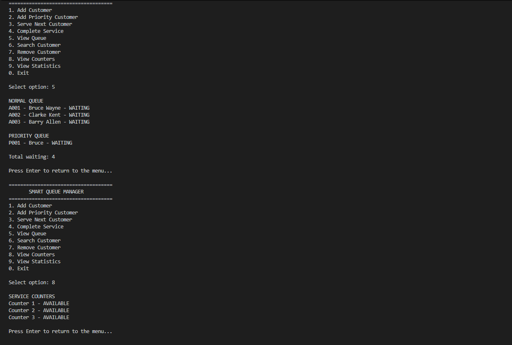

# Smart Queue Manager

A Java 21 console application for managing customer queues across multiple service counters.

Smart Queue Manager models real-world service environments such as banks, clinics, university help desks, and government offices. Its main scheduling challenge is to give priority customers earlier service **without allowing normal customers to be continually overlooked**.

The project demonstrates object-oriented programming, Java collections, priority scheduling, business rules, input validation, customer lifecycle management, and automated testing.

## Demo

## Problem

A simple priority queue can cause normal customers to wait indefinitely when priority customers continue arriving.

Smart Queue Manager addresses this using a fairness rule:

> **When both queues contain customers, a maximum of two priority customers are selected before one normal customer.**

If no normal customers are waiting, priority customers can continue to be served.

This creates a simple scheduling model that balances **priority and fairness**.

## Features

- Register normal and priority customers.
- Generate session-unique customer IDs and queue tickets.
- Process normal customers using FIFO ordering.
- Process priority customers using Java's `PriorityQueue`.
- Apply a fairness rule across priority and normal queues.
- Operate multiple service counters, with three configured by default.
- Assign customers to available counters.
- Complete services and return counters to an available state.
- Search by customer ID, ticket number, or partial name.
- Cancel waiting customers while keeping their records searchable.
- Display current queues and counter availability.
- Display session statistics and waiting-time information.
- Validate user input and reject invalid operations without terminating the application.

## Technology Stack

- **Java 21**
- **Java Collections Framework**
- **Object-Oriented Programming**
- **PowerShell**
- **VS Code**
- No external runtime dependencies

## Data Structures

Different Java collections are used according to the problem they solve:

| Data Structure | Purpose |
|---|---|
| `ArrayDeque` | Maintains normal customers in FIFO order |
| `PriorityQueue` | Orders priority customers by arrival time |
| `HashMap` | Provides fast customer lookup by ID |
| `ArrayList` | Stores service counters and returned collections |

Priority customers are ordered by arrival time, with customer ID used as a tie-breaker.

## Customer Lifecycle

Customers normally progress through:

text
WAITING → CALLED → SERVING → SERVED

A waiting customer may instead become:

text
WAITING → CANCELLED

Invalid state transitions are rejected.

For example, a customer who is already being served cannot be cancelled.

## Scheduling Logic

When selecting the next customer, the `QueueManager` considers both queues.

When both queues contain customers:

text
Priority → Priority → Normal

The consecutive-priority counter then resets.

If no normal customer is waiting, priority customers continue to be selected.

This prevents normal customers from being permanently starved while still allowing priority customers to receive earlier service.

## Service Counters

The application supports multiple service counters.

Three counters are configured by default:

text
Counter 1
Counter 2
Counter 3

Before removing a customer from a queue, the manager verifies that the requested counter exists and is available.

This prevents a failed counter assignment from accidentally removing a customer from the queue.

When service is completed, the counter becomes available again.

## Search

Customers can be searched using:

- Customer ID
- Queue/ticket number
- Partial name

Cancelled customers remain searchable so that their session history is not lost.

## Statistics

The application tracks:

- Total registered customers
- Waiting customers
- Called customers
- Customers currently being served
- Served customers
- Cancelled customers
- Priority customers waiting
- Available counters
- Busy counters
- Average waiting time
- Longest waiting time

Waiting time is measured from customer arrival until service begins.

Customers who have started service are included in waiting-time calculations, including customers whose service has already been completed.

Customers still waiting and cancelled customers are excluded.

Before the first service begins, waiting-time statistics display `N/A`.

## Automated Testing

The project includes a standalone automated test runner containing **12 test scenarios**.

Tests cover:

- FIFO ordering
- Priority ordering
- Fairness scheduling
- Empty queues
- Counter availability protection
- Service completion
- Customer cancellation
- Customer searching
- Input validation
- Queue-copy protection
- Statistics
- Customer lifecycle behavior

The tests use explicit checks rather than Java's optional `assert` keyword.

If any test fails, the runner exits with status code `1`.

## Running the Application

### Requirements

Install **JDK 21**.

No external dependencies are required.

### Compile

From the project root in PowerShell:

powershell
javac -d out -sourcepath src src\Main.java

### Run

Only run the application if compilation succeeds:

powershell
java -cp out Main

Use menu options `1–9` to perform operations.

Select `0` to exit.

If the application asks you to press Enter after an operation, press Enter to return to the main menu.

## Running the Tests

Compile the test runner into a separate output directory:

powershell
javac -d out-test -sourcepath src tests\QueueManagerTest.java

Run the tests:

powershell
java -cp out-test QueueManagerTest

The tests use a separate output directory from the application to avoid stale compiled classes.

## Project Structure

text
smart-queue-manager/
│
├── src/
│   ├── Main.java
│   │
│   ├── model/
│   │   ├── Customer.java
│   │   ├── QueueStatus.java
│   │   └── ServiceCounter.java
│   │
│   ├── service/
│   │   ├── QueueManager.java
│   │   └── QueueStatistics.java
│   │
│   └── util/
│       └── QueueNumberGenerator.java
│
├── tests/
│   └── QueueManagerTest.java
│
├── README.md
└── .gitignore

### Class Responsibilities

**`Main.java`**

Handles the interactive console menu and user input.

**`Customer.java`**

Stores customer information, status, and timing information.

**`QueueStatus.java`**

Defines the valid customer lifecycle states.

**`ServiceCounter.java`**

Manages customer assignment and service completion for an individual counter.

**`QueueManager.java`**

Contains the primary business logic for registration, scheduling, fairness, searching, cancellation, and statistics.

**`QueueStatistics.java`**

Provides an immutable snapshot of session statistics.

**`QueueNumberGenerator.java`**

Generates customer IDs and normal/priority queue tickets.

## Design Decisions

### Why `ArrayDeque`?

Normal customers follow first-in, first-out ordering, making `ArrayDeque` an appropriate collection for efficient queue operations.

### Why `PriorityQueue`?

Priority customers need to be ordered according to their arrival time while maintaining priority-based scheduling.

### Why `HashMap`?

Customer IDs provide a natural lookup key, allowing customer records to be retrieved efficiently.

### Why a fairness counter?

A pure priority system could repeatedly select priority customers while normal customers remain waiting.

The fairness counter introduces a business rule that limits consecutive priority selections when normal customers are available.

### Why check the counter before removing a customer?

A customer should not disappear from the queue because a requested service counter is unavailable.

The manager therefore validates the counter first and only removes the customer after a valid assignment can be made.

## Limitations

The current version is intentionally a session-based console application.

- Data is stored in memory and resets when the application closes.
- The system is single-threaded.
- Multiple counters represent independent service assignments, but actual processing occurs in one console thread.
- There is no database persistence.
- There is no authentication.
- There are no notifications.
- Wall-clock timestamps may be affected by system clock changes.
- The application does not currently provide a graphical interface or web API.

These limitations keep the project focused on Java fundamentals and business logic.

## Future Improvements

Potential future versions could include:

- Testable/injectable clock for deterministic timing tests.
- Stronger encapsulation of customer state mutations.
- Database persistence.
- Spring Boot REST API.
- JavaFX desktop interface.
- HTML/CSS/JavaScript frontend.
- Real-time queue dashboard.
- Historical queue analytics.
- Continuous integration with GitHub Actions.

## What This Project Demonstrates

Smart Queue Manager demonstrates how core Java concepts can be applied to a practical scheduling problem.

The project particularly focuses on:

- Object-oriented design
- Java Collections
- Data structures
- Priority scheduling
- Fairness algorithms
- Business-rule implementation
- State management
- Defensive validation
- Search operations
- Statistics
- Automated testing

Rather than simply implementing a queue, the project models the **decision-making rules surrounding a real service queue**.

## Portfolio Description

> **Java queue management application demonstrating OOP, collections, priority scheduling, fairness rules, customer lifecycle management, business logic, and automated testing.**